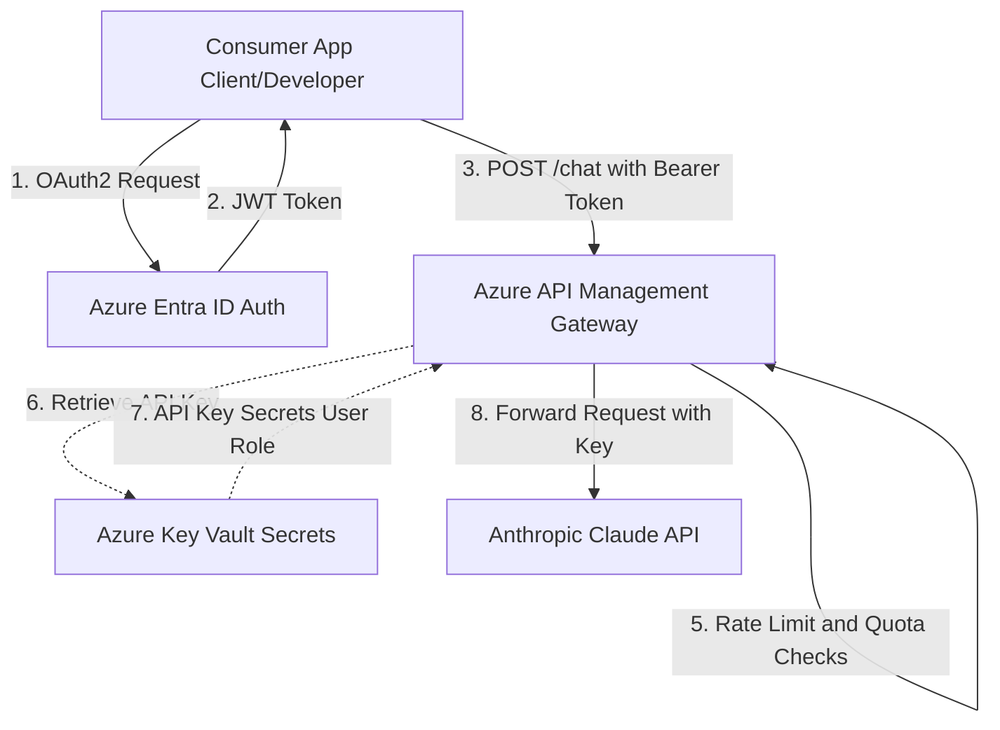
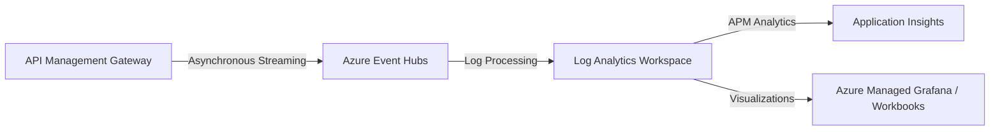

# R365 Azure FinOps for Claude AI | R365 Azure FinOps para Claude AI

Welcome to the **Platform Engineering** repository focused on AI Governance and FinOps for Large Language Models (LLMs). | Bienvenido al repositorio de **Platform Engineering** enfocado en Gobernanza y FinOps para modelos de inteligencia artificial (LLMs).

This repository demonstrates how to provision secure, auditable, and financially controlled infrastructure for business users to consume **Claude AI (Anthropic)** on Microsoft Azure. | Este repositorio demuestra cómo aprovisionar infraestructura segura, auditable y financieramente controlada para consumir **Claude AI (Anthropic)** sobre Microsoft Azure.

---

## 📐 Architecture Diagram | Diagrama de Arquitectura



---

## 💼 Business Value | Valor de Negocio

| Element | English | Español |
| :--- | :--- | :--- |
| **Problem** | Uncontrolled AI spending, raw credentials exposure, and lack of consumption tracking. | Gasto descontrolado en APIs de IA, exposición de claves crudas y falta de seguimiento del consumo. |
| **Solution** | Centralized Enterprise AI Gateway. | AI Gateway Centralizado y Empresarial. |
| **Results** | • Prevent credential leakage<br>• Limit runaway costs (429/Throttle)<br>• Enable team chargebacks<br>• Standardize AI consumption | • Evita la fuga de credenciales<br>• Limita costos desbocados (429/Throttling)<br>• Habilita chargebacks por equipo<br>• Estandariza el acceso a la IA |

---

## 🎯 Executive Summary | Resumen Ejecutivo

Organizations are accelerating their adoption of Generative AI. However, providing direct access to LLM APIs creates critical operational risks: | Las organizaciones buscan acelerar su adopción de IA Generativa. Sin embargo, dar acceso directo a las APIs de los LLMs genera riesgos operativos críticos:
1. **Financial Risk | Riesgo Financiero:** Infinite loops in code or disproportionate usage that drains the budget. | Loops infinitos en código o uso desproporcionado que agota el presupuesto.
2. **Security Risk | Riesgo de Seguridad:** Scattered credentials and unaudited traffic exposure. | Credenciales dispersas y exposición de tráfico sin auditar.
3. **Platform Complexity | Complejidad de Plataforma:** High cognitive load for developers. | Carga cognitiva alta para los desarrolladores.

### The Solution | La Solución
Implement **Azure API Management (APIM)** as the central "AI Gateway". All applications route requests to APIM, which securely injects the Claude master key from **Azure Key Vault**, enforces strict token quotas (Rate Limiting), and reports cost telemetry to observability dashboards (Datadog/Application Insights) for team Chargeback. | Implementar **Azure API Management (APIM)** como el "AI Gateway" central. Las aplicaciones envían peticiones al APIM, el cual inyecta la clave maestra desde **Azure Key Vault**, impone cuotas estrictas de tokens (Rate Limiting) y reporta telemetría de costos a los dashboards (Datadog/App Insights) para permitir el Chargeback entre equipos.

---

## 🏗️ Solution Architecture | Arquitectura de la Solución

1. **Infrastructure as Code (IaC):** `Terraform` to immutably define the entire Azure stack. | `Terraform` para definir de manera inmutable todo el stack en Azure.
2. **CI/CD:** `Azure DevOps` Pipelines to automate the `plan` and `apply` with approval gates. | Pipelines para automatizar el `plan` y `apply` con gates de aprobación.
3. **AI Gateway:** `Azure API Management` for routing, limits, and FinOps. | `Azure API Management` para enrutamiento, limits y FinOps.
4. **Secret Storage:** `Azure Key Vault` to prevent Anthropic API Key leakage. | `Azure Key Vault` que evita la fuga de la API Key de Anthropic.

---

## 💰 Cost Analysis (FinOps) | Análisis de Costos

This repository setup protects the budget through three pillars: | La configuración protege el presupuesto a través de tres pilares:

### 1. Hard Limits (Bug Protection | Protección contra Bugs)
The XML policy injected into APIM restricts consumption to a maximum of **50 requests per minute per Team Subscription**. If a user triggers a "retry storm" or infinite loop, the API Gateway blocks the request (`429 Too Many Requests`) before reaching Claude's servers, saving thousands of dollars. | La política XML en el APIM restringe el consumo a **50 peticiones por minuto por Suscripción de Equipo**. Si hay un "retry storm", el Gateway bloquea la petición (`429 Too Many Requests`) antes de llegar a Claude, salvando miles de dólares.

### 2. Monthly Quotas (Budgeting | Cuotas Mensuales)
Configured to limit consumption to **10,000 calls per month** per team, protecting against abusive scraping and ensuring fair budget distribution. | Configurado para limitar el consumo a **10,000 llamadas al mes** por equipo, protegiendo contra scraping abusivo y garantizando distribución justa.

### 3. Smart Caching and Routing (Future | Caching y Enrutamiento Inteligente)
*   **Prompt Caching:** In phase 2, APIM can intercept similar requests and use context caching to reduce "Input Tokens" cost. | En fase 2, el APIM puede interceptar solicitudes similares usando caché de contexto para reducir el costo de "Input Tokens".
*   **Haiku vs Opus:** The gateway can route simple requests to Claude 3 Haiku (cheaper) and reserve Claude 3.5 Sonnet or Opus for intensive reasoning workloads. | El gateway puede rutear peticiones simples a Claude 3 Haiku y reservar Sonnet u Opus para cargas intensivas.
## 🗺️ Enterprise Evolution Roadmap | Ruta de Evolución Empresarial

This repository represents the initial foundation. The platform is designed to scale across the following architectural Epics:
Este repositorio representa la base inicial. La plataforma está diseñada para escalar a través de las siguientes Épicas arquitectónicas:

*   **Phase 0: Current Foundation | Base Actual** - IaC for APIM gateway + limits.
*   **Phase 1: Token Observability | Observabilidad de Tokens** - Real chargeback & metrics via Event Hub.
*   **Phase 2: Multi-Model Routing & Entra ID | Enrutamiento Multi-Modelo y Entra ID** - Unified `/chat` endpoint + Azure Entra ID OAuth2 authentication.
*   **Phase 3: Budget & Intelligent Routing | Presupuestos y Enrutamiento Inteligente** - Dollar-based quotas + prompt size router (Haiku vs Sonnet).
*   **Phase 4: Self-Service Platform | Plataforma Self-Service** - Backstage-style GitOps portal to request credentials.
*   **Phase 5: Responsible AI & Hardening | IA Responsable y Seguridad** - PII/DLP inspection + Private Endpoints.

To see the full architectural specification of these phases, read the **[Enterprise Evolution Roadmap](ROADMAP_ENTERPRISE.md)**.
Para ver la especificación arquitectónica completa de estas fases, lee el **[Roadmap de Evolución Empresarial](ROADMAP_ENTERPRISE.md)**.

---

## 🚀 Step-by-Step Guide | Guía Paso a Paso

### Repository Structure | Estructura del Repositorio

```text
r365-azure-finops-claude/
├── pipelines/
│   └── azure-pipelines.yml      # CI/CD for Azure DevOps
├── terraform/
│   ├── main.tf                  # APIM & Key Vault resource definitions
│   ├── providers.tf             # Azure provider config
│   ├── variables.tf             # Parameterizable variables
│   └── policies/
│       └── apim-claude-policy.xml # FinOps & Rate Limiting Policy
└── README.md                    # This documentation | Esta documentación
```

### How to Deploy? | ¿Cómo Desplegar?

1. **Configure the Service Connection:** In Azure DevOps, create a Service Connection to your Azure subscription named `coatl-azure-sc`. | En Azure DevOps, crea un Service Connection hacia tu suscripción de Azure llamado `coatl-azure-sc`.
2. **Create the Pipeline:** In Azure DevOps, create a new pipeline pointing to the `pipelines/azure-pipelines.yml` file in this repository. | Crea un nuevo pipeline apuntando al archivo `pipelines/azure-pipelines.yml`.
3. **Configure the Terraform Backend:** Create an Azure Storage Account named `tfstatestoragecoatl` inside a Resource Group `tfstate-rg` to store the state. | Crea un Storage Account en Azure llamado `tfstatestoragecoatl` dentro de `tfstate-rg` para el estado.
4. **Push & Deploy:** Upon merging to `main`, the pipeline runs the `Plan` stage. After review, the `Apply` executes. | Al hacer merge a `main`, se ejecuta el `Plan`. Tras la revisión, se ejecutará el `Apply`.


## 📊 Phase 1: Token Observability & KQL Analytics | Observabilidad de Tokens y Analítica KQL

To achieve real-time token tracking and chargebacks without introducing HTTP latency, we stream API request metrics asynchronously from APIM to Azure Monitor and Grafana. | Para lograr el seguimiento de tokens y chargebacks en tiempo real sin introducir latencia HTTP, transmitimos las métricas de APIM de forma asíncrona hacia Azure Monitor y Grafana.



### 1. APIM Logging Policy | Política de Logging en APIM
The gateway extracts the token metadata (input, output, model, and department) and sends a JSON payload to Event Hubs: | El gateway extrae los metadatos de tokens (entrada, salida, modelo y departamento) y envía un payload JSON a Event Hubs:

```xml
<outbound>
    <base />
    <!-- Stream FinOps metrics asynchronously to Event Hubs | Transmite métricas FinOps asíncronamente a Event Hubs -->
    <log-to-eventhub logger-id="finops-eventhub-logger">
        @((string)context.Variables["finops-metric-payload"])
    </log-to-eventhub>
</outbound>
```

### 2. KQL FinOps Queries | Consultas KQL de FinOps
Once streamed to Log Analytics, SREs run KQL queries to monitor cost and consumption: | Una vez transmitidos a Log Analytics, los SREs ejecutan consultas KQL para monitorear costos y consumo:

*   **A. Estimated Spend in USD by Team (Claude 3.5 Sonnet) | Gasto Estimado en USD por Equipo:**
    ```kql
    ApiManagementGatewayLogs
    | where timestamp > ago(30d)
    | where Model == "claude-3-5-sonnet"
    | extend CostInput = (InputTokens * 3.00) / 1000000
    | extend CostOutput = (OutputTokens * 15.00) / 1000000
    | extend TotalCostUSD = CostInput + CostOutput
    | summarize TotalSpend = sum(TotalCostUSD) by Team
    | render piechart
    ```

*   **B. Monitor API Gateway 429 Rate Limiting Triggers | Monitoreo de Bloqueos de Rate-Limit (429):**
    ```kql
    ApiManagementGatewayLogs
    | where timestamp > ago(24h)
    | where ResponseCode == 429
    | summarize BlockCount = count() by Team, bin(timestamp, 1h)
    | render timechart
    ```

---

## 📈 Professional Pitch | Discurso Profesional

This project demonstrates practical skills in **Platform Engineering**, **AI Governance**, and **FinOps for LLMs**. You can describe this project on your LinkedIn or Resume as follows:

Este proyecto demuestra habilidades prácticas en **Platform Engineering**, **Gobernanza de IA** y **FinOps para LLMs**. Puedes describir este proyecto en tu LinkedIn o Currículum de la siguiente manera:

> **Designed and implemented an enterprise AI Gateway platform on Azure using Terraform, API Management, Key Vault, and Azure DevOps, enabling secure, governed, and cost-controlled access to Anthropic Claude models.**
> 
> *Implemented FinOps controls including rate limiting, quota enforcement, centralized credential management, chargeback telemetry, and CI/CD automation, providing a scalable foundation for multi-team Generative AI adoption.*
> 
> *Architected the platform to support future multi-model routing, AI governance policies, observability, and budget enforcement across enterprise workloads.*

---
*Designed with a focus on Security, Reliability, and FinOps. | Diseñado con foco en Seguridad, Confiabilidad y FinOps.*
