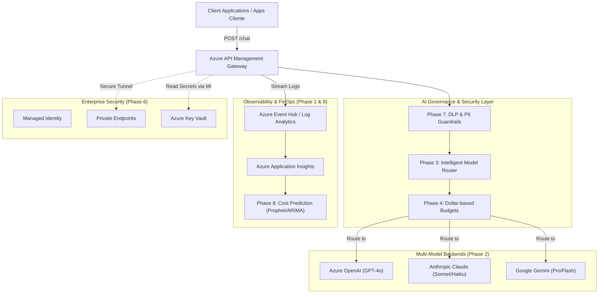

# 🗺️ Enterprise AI Gateway Platform: Evolution Roadmap | Ruta de Evolución de Plataforma AI Gateway

This document outlines the **8-Phase Evolution Roadmap** to transform this repository from an infrastructure demonstration into a fully-fledged, production-ready **Enterprise AI Consumption Platform**.

Este documento detalla la **Ruta de Evolución en 8 Fases** para transformar este repositorio de una demostración de infraestructura a una **Plataforma de Consumo de IA Empresarial** lista para producción.

---

## 📐 Conceptual Architecture | Arquitectura Conceptual



---

## 🛠️ The 8-Phase Evolution | Las 8 Fases de Evolución

### 📊 Phase 1: Real Observability & FinOps Telemetry | Observabilidad Real y Telemetría FinOps

Currently, the platform logs basic HTTP traffic. The goal is to capture **token-level usage** and attribute exact costs per request for chargeback.

Actualmente, la plataforma registra tráfico HTTP básico. El objetivo es capturar el **uso a nivel de tokens** y atribuir costos exactos por petición para permitir el chargeback.

#### 1. Metric JSON Schema | Esquema JSON de Métricas
For every request, the gateway extracts metadata and token metrics:
```json
{
  "team": "finance",
  "model": "claude-3-5-sonnet",
  "input_tokens": 1200,
  "output_tokens": 450,
  "estimated_cost_usd": 0.023,
  "timestamp": "2026-06-04T13:55:00Z"
}
```

#### 2. APIM Implementation Strategy | Estrategia de Implementación en APIM
We will use APIM's `<log-to-eventhub>` policy to asynchronously stream request and response payloads to Azure Event Hubs without impacting latency, which then routes them to Log Analytics and Application Insights:
```xml
<outbound>
    <base />
    <!-- Extract token counts and log details asynchronously -->
    <log-to-eventhub logger-id="finops-logger">
        @((string)context.Variables["finops-metric-payload"])
    </log-to-eventhub>
</outbound>
```

---

### 🌐 Phase 2: Multi-Provider Gateway (Azure OpenAI + Anthropic + Gemini) | Gateway Multi-Proveedor

Enterprise applications require vendor neutrality. The AI Gateway will expose a standardized `/chat` endpoint and abstract the underlying providers.

Las aplicaciones empresariales requieren neutralidad de proveedor. El AI Gateway expondrá un endpoint `/chat` estandarizado y abstraerá los proveedores subyacentes.

*   **Client interface:** Sends standard JSON requests to `/chat`.
*   **Routing logic:** APIM inspects headers (e.g., `X-Team-Identity`) or the body payload and forwards the request to the target backend:
    *   `team: finance` $\rightarrow$ Routes to **Azure OpenAI (GPT-4o)**
    *   `team: support` $\rightarrow$ Routes to **Anthropic Claude Haiku** (Cost-efficient)
    *   `team: engineering` $\rightarrow$ Routes to **Anthropic Claude Sonnet**

---

### 🧠 Phase 3: Intelligent Model Routing | Enrutamiento Inteligente de Modelos

Optimize costs automatically by evaluating prompt complexity (e.g., token size) before dispatching the request to the most expensive models.

Optimiza costos automáticamente evaluando la complejidad del prompt (ej. cantidad de tokens) antes de despachar la solicitud a los modelos más costosos.

```python
# Conceptual Gateway Routing Logic
if prompt_tokens < 500:
    route_to("claude-3-haiku")      # Ultra-cheap for simple queries
elif prompt_tokens < 5000:
    route_to("claude-3-5-sonnet")  # Standard balanced option
else:
    route_to("claude-3-opus")       # Advanced reasoning tasks only
```

Inside APIM, this is achieved by checking the `Content-Length` or using a lightweight script to estimate token lengths within an inbound XML policy before backend selection.

---

### 💵 Phase 4: Dollar-Based Budgets & Quotas | Presupuestos por Equipo Basados en Dólares

Transitioning from "requests per month" to "dollars per month" because token consumption determines the actual API bill.

Transición de "peticiones por mes" a "dólares por mes" ya que el consumo de tokens determina la factura real de la API.

*   **Marketing Budget:** $\$500$/month.
*   **Engineering Budget:** $\$3,000$/month.
*   **Finance Budget:** $\$1,000$/month.

#### Throttling & Alerts Flow:
1.  **At 80% Budget Consumed:** Trigger alerts via Webhooks to **Microsoft Teams**, **Slack**, or **ServiceNow** using Azure Logic Apps.
2.  **At 100% Budget Consumed:** APIM dynamically overrides the backend response and throttles requests with a `403 Forbidden (Budget Exhausted)`.

---

### 🚀 Phase 5: Developer Self-Service Platform (Internal Developer Portal) | Plataforma Self-Service para Desarrolladores

To eliminate infrastructure bottlenecks, developer teams can request AI credentials via a self-service portal (e.g., **Spotify Backstage** or Azure Developer CLI).

Para eliminar cuellos de botella de infraestructura, los desarrolladores pueden solicitar credenciales de IA a través de un portal self-service (ej. **Spotify Backstage**).

```text
Developer Form:
  - Team: Finance
  - Model: Claude 3.5 Sonnet
  - Environment: Production
```

Upon form submission, a GitOps pipeline automatically runs Terraform to provision:
1.  A dedicated **APIM Subscription**.
2.  A corresponding **APIM Product** configuration.
3.  An **Azure Key Vault Secret** (if custom keys are needed).
4.  Appropiate XML Policy attachment.

---

### 🔒 Phase 6: Enterprise Security hardening | Seguridad Empresarial Robusta

Securing the AI Gateway for highly regulated environments (SOC 2 Type II / SOX compliance).

Asegurando el AI Gateway para entornos altamente regulados (cumplimiento de SOC 2 Tipo II / SOX).

#### 1. System-Assigned Managed Identity
We eliminate static credentials between APIM and Azure Key Vault. APIM is assigned a Managed Identity with the **Key Vault Secrets User** role.
```hcl
# main.tf resource adjustment
resource "azurerm_key_vault_access_policy" "apim_policy" {
  key_vault_id = azurerm_key_vault.kv.id
  tenant_id    = data.azurerm_client_config.current.tenant_id
  object_id    = azurerm_api_management.apim.identity[0].principal_id

  secret_permissions = ["Get", "List"]
}
```

#### 2. Private Endpoints
All traffic between the consumer application, APIM, Key Vault, and Azure OpenAI flows through private virtual networks using **Private Endpoints**, ensuring zero public internet exposure.

Todo el tráfico entre la aplicación, el APIM, Key Vault y Azure OpenAI fluye a través de redes virtuales privadas usando **Private Endpoints**, garantizando cero exposición a internet público.

---

### 🛡️ Phase 7: Responsible AI & DLP Guardrails | IA Responsable y DLP

Inspecting request prompts and model responses at the gateway layer to block sensitive data leakage (PII) before it leaves the corporate perimeter.

Inspeccionar los prompts y respuestas en la capa del gateway para bloquear fugas de datos sensibles (PII) antes de que salgan del perímetro corporativo.

*   **APIM Inbound Regex Inspection:** Detect and redact:
    *   Social Security Numbers (SSN) / CURP.
    *   Credit Card Numbers.
    *   Passwords / Tokens.
*   **Responsible AI Policy:** Block offensive or out-of-bounds prompts using pre-compiled rules or routing to Azure AI Content Safety APIs.

---

### 🔮 Phase 8: ML-Based Cost Prediction | Predicción de Costos con Machine Learning

Leveraging historic FinOps logs to train models that forecast monthly AI expenses.

Aprovechar los logs históricos de FinOps para entrenar modelos que pronostiquen los gastos mensuales en IA.

*   **Data Pipeline:** Stream Event Hub logs to an **Azure Data Lake**.
*   **Training Script:** Python-based forecasting using **Prophet** or **ARIMA** models inside **Azure Machine Learning**.
*   **Predictive Dashboard:**
    *   `Current Spend: $10,230`
    *   `Projected Month-End Spend: $14,500` (Flags alerts if it exceeds the budgeted $12,000 threshold).

---

## 📈 LinkedIn & Resume Pitch | Discurso para LinkedIn y Currículum

Here is how to represent the design and potential of this platform on your professional profile:

Aquí tienes cómo representar el diseño y potencial de esta plataforma en tu perfil profesional:

> **Designed and implemented an enterprise AI Gateway platform on Azure using Terraform, API Management, Key Vault, and Azure DevOps, enabling secure, governed, and cost-controlled access to Anthropic Claude models.**
> 
> *Implemented FinOps controls including rate limiting, quota enforcement, centralized credential management, chargeback telemetry, and CI/CD automation, providing a scalable foundation for multi-team Generative AI adoption.*
> 
> *Architected the platform to support future multi-model routing, AI governance policies, observability, and budget enforcement across enterprise workloads.*
